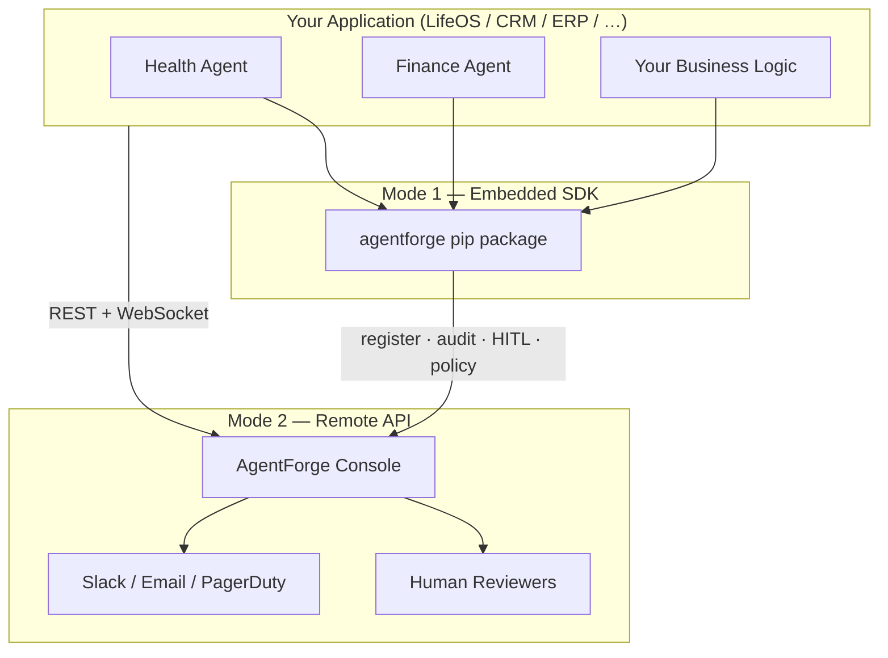

# AgentForge

**Open Enterprise Agent Framework**

[](https://github.com/agentforge-oss/agentforge/actions)
[](https://pypi.org/project/agentforge)
[](https://pypi.org/project/agentforge)
[](LICENSE)
[](https://agentforge.readthedocs.io)

AgentForge is a production-grade framework for building, governing, and auditing AI agents in enterprise environments. It fills the gap between **LLM SDKs** (which handle model calls) and **enterprise requirements** (identity, governance, compliance, human oversight) that every serious production deployment needs.

> **Designed for teams** that can't afford to let an agent do the wrong thing in production.

---

## Why AgentForge?

Most agent frameworks are optimised for demos. AgentForge is optimised for production:

| Concern | Without AgentForge | With AgentForge |
|---|---|---|
| Who is this agent? | String in a prompt | Signed identity + RBAC |
| Can this agent do that? | Nothing stops it | Authority scopes + policy engine |
| What did the agent do? | Maybe some print statements | Tamper-evident audit trail |
| Sensitive action? | Hope for the best | HITL approval workflow |
| SOC 2 / HIPAA / GDPR? | Manual paperwork | Built-in compliance profiles |
| Which LLM? | Hard-coded | Swap adapter in one line |

---

## Architecture

```
┌─────────────────────────────────────────────────────────────────┐
│                         Your Application                         │
└───────────────────────────────┬─────────────────────────────────┘
                                │
┌───────────────────────────────▼─────────────────────────────────┐
│                    AgentForge Orchestration Layer                 │
│                                                                   │
│  ┌──────────┐  ┌──────────┐  ┌────────────┐  ┌──────────────┐  │
│  │  AIAM    │  │ Registry │  │ Governance │  │     HITL     │  │
│  │ Identity │  │Discovery │  │  Engine    │  │Orchestration │  │
│  │  + RBAC  │  │Versioning│  │SOC2/HIPAA/ │  │  Approvals   │  │
│  │  + Trust │  │          │  │    GDPR    │  │  Escalation  │  │
│  └────┬─────┘  └────┬─────┘  └─────┬──────┘  └──────┬───────┘  │
│       │             │               │                 │          │
│  ┌────▼─────────────▼───────────────▼─────────────────▼───────┐ │
│  │                    Auditability SDK                          │ │
│  │           Structured Events · Tamper-evident Chain          │ │
│  │                   Replay · Compliance Export                 │ │
│  └──────────────────────────────────────────────────────────────┘ │
│                                                                   │
│  ┌────────────────────────────────────────────────────────────┐  │
│  │                  Enterprise Agent Runtime                    │  │
│  │  ┌──────────┐ ┌──────────┐ ┌───────────┐ ┌─────────────┐  │  │
│  │  │Anthropic │ │  OpenAI  │ │LangChain/ │ │  GCP Vertex │  │  │
│  │  │  Claude  │ │  GPT-4o  │ │ LangGraph │ │   Gemini    │  │  │
│  │  └──────────┘ └──────────┘ └───────────┘ └─────────────┘  │  │
│  └────────────────────────────────────────────────────────────┘  │
└─────────────────────────────────────────────────────────────────┘
```

---

## Components

### 🔐 AIAM — Agent Identity & Authority Management
Every agent gets a **cryptographically-signed identity** and a set of **authority scopes**. Supports RBAC with role inheritance, delegation chains (agent A delegates to agent B with narrowed scopes), and short-lived signed credentials.

```python
from agentforge.aiam import AgentIdentity, AgentCredential, RBACPolicy

identity = AgentIdentity.create(
    name="invoice-processor",
    roles=["operator"],
    owner="finance-team",
)

credential = AgentCredential.issue(
    identity, scopes=["invoices:read", "summaries:write"], ttl=300, secret=SECRET
)
assert credential.verify(SECRET)  # HMAC-SHA256 signed

rbac = RBACPolicy.enterprise_baseline()
rbac.agent_has_permission(["admin"], Permission("agents", "register"))  # True
```

### 📋 Agent Registry
The single source of truth for what agents exist and what they can do. Supports **versioning**, **capability declarations**, and both **in-memory** and **SQLite** backends. Plug in Postgres or Redis with a custom `RegistryBackend`.

```python
from agentforge.registry import AgentRegistry, AgentManifest, AgentCapability

registry = AgentRegistry()
registry.register(AgentManifest(
    agent_id="invoice-processor-001",
    name="Invoice Processor",
    version="2.1.0",
    capabilities=[
        AgentCapability("extract_invoice", "Extract data from PDF", requires_hitl=False),
        AgentCapability("initiate_payment", "Initiate wire transfer", requires_hitl=True),
    ],
    tags=["finance"],
))

# Discover agents by capability
from agentforge.registry.discovery import AgentDiscovery, DiscoveryQuery
results = AgentDiscovery(registry).find(DiscoveryQuery(capability="extract_invoice"))
```

### 🏛️ Governance Framework
A composable **policy engine** with an explicit-deny-wins evaluation model. Ships with pre-built compliance profiles for **SOC 2 Type II**, **HIPAA**, and **GDPR** that you can extend with custom rules.

```python
from agentforge.governance import SOC2Profile, PolicyContext

engine = SOC2Profile.engine()  # or HIPAAProfile / GDPRProfile

decision = engine.evaluate(PolicyContext(
    agent_id="payment-agent",
    agent_roles=["operator"],
    action="delete",
    resource="financial-records",
    environment="production",
))

if decision.requires_hitl:
    await orchestrator.request_approval(...)
elif decision.is_denied:
    raise PermissionError(decision.reason)
```

### 📊 Auditability SDK
Every agent action, tool call, policy decision, and HITL event is recorded as a **tamper-evident, chained audit event**. Each event links to the previous one via its `previous_event_id` — making silent deletion detectable.

```python
from agentforge.audit import AuditLogger, AuditTrail, EventType
from agentforge.audit.logger import InMemoryAuditSink

sink = InMemoryAuditSink()
logger = AuditLogger(sinks=[sink, FileAuditSink("./audit.log")])
trail = AuditTrail(sink)

logger.tool_invoked("agent-001", correlation_id, tool="send_email")

# Replay the full decision trail for a workflow run
steps = trail.replay(correlation_id)
violations = trail.violations(since=start_of_quarter)
```

### 🧑‍💼 HITL Orchestration
Async human-in-the-loop approval workflows with configurable **escalation tiers** (L1 → L2 → Exec), timeouts, and pluggable notification callbacks (Slack, email, PagerDuty).

```python
from agentforge.hitl import HITLOrchestrator, EscalationPolicy

orchestrator = HITLOrchestrator(
    escalation_policy=EscalationPolicy.standard(),  # 15min → 30min → 60min
    notify=slack_notifier,
)

# Agent suspends here until a human decides
decision = await orchestrator.request_approval(
    agent_id="payment-agent",
    correlation_id=run_id,
    action="wire_transfer",
    resource="payment-gateway",
    context={"amount_usd": 75_000, "recipient": "Vendor Corp"},
)

if not decision.approved:
    raise PermissionError(f"Rejected: {decision.reason}")
```

### ⚡ Enterprise Agent Runtime
Framework-agnostic runtime with adapters for **Anthropic Claude**, **OpenAI GPT-4o**, **LangChain/LangGraph**, and **Google Cloud Vertex AI (Gemini)**. Normalised inputs/outputs mean you can swap providers without changing business logic.

```python
from agentforge.runtime import AgentRuntime, AgentContext, get_adapter

# Pick any adapter
adapter = get_adapter("anthropic", api_key="sk-ant-...", model="claude-opus-4-5")
# adapter = get_adapter("openai", api_key="sk-...", model="gpt-4o")
# adapter = get_adapter("vertex", project="my-gcp-project")

runtime = AgentRuntime(adapter=adapter)
await runtime.start()

result = await runtime.invoke(AgentContext.create(
    agent_id="invoice-processor-001",
    prompt="Extract all line items from the attached invoice.",
    tools=[extract_tool_definition],
))
```

---

## Enterprise UI Console

A full-stack dashboard for non-technical and technical users alike — live HITL approvals, audit trail replay, agent registry browser, and real-time event feed.

```bash
# 1. Install UI dependencies (one-time)
pip install "agentforge[dev]" fastapi uvicorn

# 2. Start the console
python ui/backend/main.py

# 3. Open http://localhost:8000
```

Four screens ship out of the box, pre-loaded with LifeOS demo data:

| Screen | What it shows |
|---|---|
| **Dashboard** | Agent health grid, recent activity, violation count, HITL queue status |
| **HITL Approvals** | Pending actions waiting for your decision — approve or reject with reason |
| **Audit Trail** | Searchable event log with payload inspector and run replay |
| **Agent Registry** | All registered agents, capabilities, runtime adapters, register new agents |

Real-time WebSocket push keeps the HITL badge and event feed live without refreshing.

---

## Integration with LifeOS and Other Apps

AgentForge integrates with any application — LifeOS (the demo personal-agent system), CRM, billing, HR, DevOps, or your own backend — via the **embedded SDK**, the **REST API**, or a **hybrid** of both.

### Architecture



**Hybrid production setup** (recommended):

```
┌──────────────────────────────────────────────────────────┐
│  Your App Backend (Python / Node / Go)                   │
│  ┌────────────┐  ┌────────────┐  ┌────────────┐         │
│  │ Agent A    │  │ Agent B    │  │ Agent C    │         │
│  └─────┬──────┘  └─────┬──────┘  └─────┬──────┘         │
│        └──────── agentforge SDK ────────┘                │
└────────────────────────┬─────────────────────────────────┘
                         │ REST · WebSocket
┌────────────────────────▼─────────────────────────────────┐
│  AgentForge Console (Docker / Railway / K8s)             │
│  HITL approvals · Audit trail · Registry · Compliance    │
└──────────────────────────────────────────────────────────┘
```

### Integration modes

| Mode | Best for | What you use |
|---|---|---|
| **Embedded SDK** | Agent code runs in your app (LifeOS backend) | `pip install agentforge` — registry, governance, audit, HITL in-process |
| **Remote API** | Any language / microservices | `POST /api/agents`, `GET /api/hitl/pending`, `POST /api/hitl/{id}/approve` |
| **Hybrid** | Production | SDK in agent services + deployed console for human reviewers |

### LifeOS example

LifeOS is the demo scenario shipped with AgentForge — five personal agents (health, finance, goals, journal, scheduler) owned by `lifeos-core`. The same pattern applies to any multi-agent app.

**Embedded SDK** (runs locally, no server needed):

```bash
python examples/lifeos_integration.py
```

**Sync to a running console** (local, Docker, or Railway):

```bash
python examples/lifeos_integration.py --api-url http://localhost:8000
python examples/lifeos_integration.py --api-url https://your-app.railway.app
# → Open console → HITL Approvals → approve the rent transfer
```

**Minimal SDK integration in your app:**

```python
from agentforge.registry import AgentRegistry, AgentManifest, AgentCapability
from agentforge.governance import SOC2Profile, PolicyContext
from agentforge.audit import AuditLogger, EventType
from agentforge.hitl import HITLOrchestrator, EscalationPolicy

registry = AgentRegistry()
registry.register(AgentManifest(
    agent_id="finance-agent-001",
    name="Finance Manager",
    owner="lifeos-core",  # or "your-company-core"
    capabilities=[
        AgentCapability("transfer_funds", "Move money", requires_hitl=True),
    ],
))

audit = AuditLogger(sinks=[...])
gov = SOC2Profile.engine()
hitl = HITLOrchestrator(escalation_policy=EscalationPolicy.standard())

async def transfer_funds(amount: float, payee: str, run_id: str):
    agent_id = "finance-agent-001"
    audit.log(EventType.AGENT_STARTED, agent_id, run_id)

    decision = gov.evaluate(PolicyContext(
        agent_id=agent_id, agent_roles=["operator"],
        action="transfer_funds", resource="bank-account",
        environment="production", metadata={"amount_usd": amount},
    ))
    if decision.is_denied:
        raise PermissionError(decision.reason)

    approval = await hitl.request_approval(
        agent_id=agent_id, correlation_id=run_id,
        action="transfer_funds", resource="bank-account",
        context={"amount_usd": amount, "payee": payee},
    )
    if not approval.approved:
        raise PermissionError(approval.reason)

    # … execute transfer …
    audit.tool_completed(agent_id, run_id, "transfer_funds")
```

### REST API reference

| Endpoint | Method | Purpose |
|---|---|---|
| `/health` | GET | Liveness check |
| `/api/agents` | GET / POST | List or register agents |
| `/api/hitl/pending` | GET | Pending approval queue |
| `/api/hitl/{id}/approve` | POST | Approve a HITL request |
| `/api/hitl/{id}/reject` | POST | Reject a HITL request |
| `/api/audit` | GET | Search audit events |
| `/api/audit/{correlation_id}/replay` | GET | Replay a workflow run |
| `/ws/events` | WebSocket | Real-time event stream |
| `/docs` | GET | Interactive OpenAPI docs |

Use a shared `correlation_id` (e.g. `run-mon-001`) across all agent actions in a workflow so the audit trail can replay the full decision chain.

See also:
- [`examples/lifeos_integration.py`](examples/lifeos_integration.py) — LifeOS SDK + API demo
- [`examples/enterprise_workflow.py`](examples/enterprise_workflow.py) — enterprise payment workflow
- [`scripts/seed_demo.py`](scripts/seed_demo.py) — load demo data into a running console

---

## Quick Start

```bash
pip install agentforge

# With your preferred LLM provider:
pip install "agentforge[anthropic]"
pip install "agentforge[openai]"
pip install "agentforge[vertex]"
pip install "agentforge[all]"       # all providers
```

```python
import asyncio
from agentforge.aiam import AgentIdentity, RBACPolicy, Permission
from agentforge.governance import SOC2Profile, PolicyContext
from agentforge.audit import AuditLogger, EventType
from agentforge.audit.logger import InMemoryAuditSink

async def main():
    # 1. Create an agent identity
    identity = AgentIdentity.create("my-agent", roles=["operator"], owner="my-team")

    # 2. Audit everything
    sink = InMemoryAuditSink()
    logger = AuditLogger(sinks=[sink])
    logger.log(EventType.AGENT_STARTED, identity.agent_id, "run-001")

    # 3. Govern every action
    engine = SOC2Profile.engine()
    decision = engine.evaluate(PolicyContext(
        agent_id=identity.agent_id,
        agent_roles=identity.roles,
        action="write",
        resource="financial-reports",
        environment="production",
    ))
    print(f"Governance decision: {decision.effect.value}")  # allow / deny / require_hitl

asyncio.run(main())
```

See [`examples/enterprise_workflow.py`](examples/enterprise_workflow.py) for a complete end-to-end demo, and [`examples/lifeos_integration.py`](examples/lifeos_integration.py) for LifeOS / multi-agent app integration.

---

## Design Principles

**Zero mandatory dependencies.** The core package has no required dependencies. LLM SDK packages (`anthropic`, `openai`, etc.) are optional extras. This keeps the framework usable in any environment.

**Explicit deny wins.** Both the authority scope model and the policy engine use an explicit-deny-wins evaluation strategy. One deny rule stops an action regardless of how many allow rules match.

**Scopes narrow, never widen.** Delegation tokens can only restrict an agent's authority — a delegating agent cannot grant permissions it doesn't hold itself. Trust chains enforce this at construction time.

**Audit first.** Every component emits structured events to the `AuditLogger`. The logger is pluggable (console, file, your SIEM). The `AuditTrail` class provides tamper-evidence through chained event IDs.

**Adapters, not abstractions.** The runtime adapters are thin wrappers — they normalise I/O but don't hide provider features. If your LLM provider has a unique capability, you can always access `result.raw_response`.

---

## Roadmap

- [ ] **v0.2** — PostgreSQL registry backend + Redis HITL queue
- [ ] **v0.3** — OpenTelemetry trace integration for the Auditability SDK
- [ ] **v0.4** — Agent-to-agent trust chain verification in the runtime
- [ ] **v0.5** — OPA (Open Policy Agent) backend for the Governance engine
- [ ] **v1.0** — Stable API + SDK for custom registry and audit backends

---

## Contributing

Contributions are welcome. Please read [CONTRIBUTING.md](CONTRIBUTING.md) and open an issue before submitting a large PR.

```bash
git clone https://github.com/agentforge-oss/agentforge
cd agentforge
pip install -e ".[dev]"
pytest tests/ -v
```

---

## License

Apache 2.0 — see [LICENSE](LICENSE).

---

*AgentForge is not affiliated with Anthropic, OpenAI, Google, or LangChain.*
