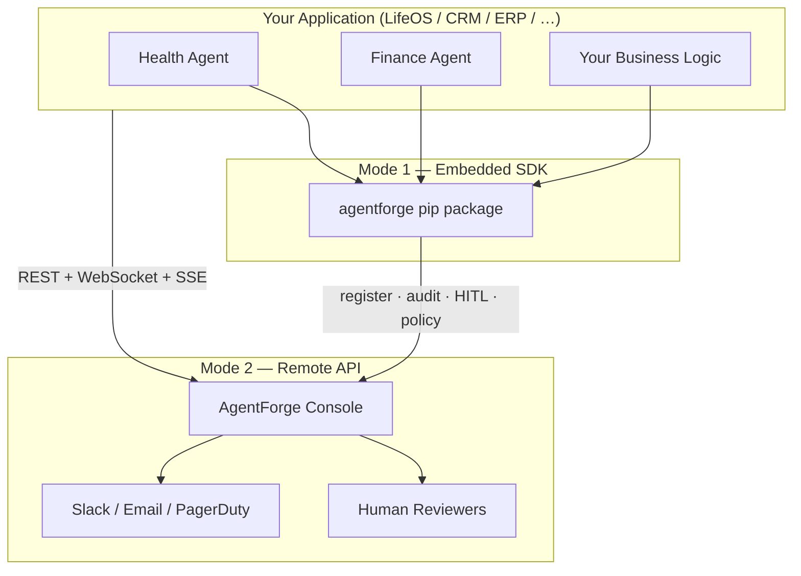

# AgentForge

**Open Enterprise Agent Framework**

[](https://github.com/yudira-repos/agent-forge/actions/workflows/ci.yml)
[](pyproject.toml)
[](LICENSE)

> Status: alpha. Not published to PyPI; install from source (see Quick Start).

AgentForge is a production-grade framework for building, governing, and auditing AI agents in enterprise environments. It fills the gap between **LLM SDKs** (which handle model calls) and **enterprise requirements** (identity, governance, compliance, human oversight) that every serious production deployment needs.

> **Designed for teams** that can't afford to let an agent do the wrong thing in production.

---

## Why AgentForge?

Most agent frameworks are optimised for demos. AgentForge is optimised for production:

| Concern | Without AgentForge | With AgentForge |
|---|---|---|
| Who is this agent? | String in a prompt | Signed identity + RBAC |
| Can this agent do that? | Nothing stops it | Authority scopes + policy engine |
| What did the agent do? | Maybe some print statements | Hash-chained, verifiable audit trail |
| Sensitive action? | Hope for the best | HITL approval workflow |
| SOC 2 / HIPAA / GDPR? | Manual paperwork | Built-in compliance profiles |
| Which LLM? | Hard-coded | Swap adapter in one line |
| Multi-agent workflow? | Custom glue code | Visual DAG designer + LangGraph |
| Latency / cost visibility? | None | Per-agent OTEL metrics + trace viewer |

---

## Architecture

```
┌─────────────────────────────────────────────────────────────────┐
│                         Your Application                         │
└───────────────────────────────┬─────────────────────────────────┘
                                │
┌───────────────────────────────▼─────────────────────────────────┐
│                    AgentForge Orchestration Layer                 │
│                                                                   │
│  ┌──────────┐  ┌──────────┐  ┌────────────┐  ┌──────────────┐  │
│  │  AIAM    │  │ Registry │  │ Governance │  │     HITL     │  │
│  │ Identity │  │Discovery │  │  Engine    │  │Orchestration │  │
│  │  + RBAC  │  │Versioning│  │SOC2/HIPAA/ │  │  Approvals   │  │
│  │  + Trust │  │          │  │    GDPR    │  │  Escalation  │  │
│  └────┬─────┘  └────┬─────┘  └─────┬──────┘  └──────┬───────┘  │
│       │             │               │                 │          │
│  ┌────▼─────────────▼───────────────▼─────────────────▼───────┐ │
│  │                    Auditability SDK                          │ │
│  │           Structured Events · Hash-chained Log              │ │
│  │           Replay · Compliance Export · OTEL Spans           │ │
│  └──────────────────────────────────────────────────────────────┘ │
│                                                                   │
│  ┌────────────────────────────────────────────────────────────┐  │
│  │               Workflow Engine (custom + LangGraph)          │  │
│  │   Trigger · Agent · API · Condition · Transform · Loop      │  │
│  │   Event · SubWorkflow · HITL Gate · LangGraph DAG           │  │
│  └────────────────────────────────────────────────────────────┘  │
│                                                                   │
│  ┌────────────────────────────────────────────────────────────┐  │
│  │                  Enterprise Agent Runtime                    │  │
│  │  ┌──────────┐ ┌──────────┐ ┌───────────┐ ┌─────────────┐  │  │
│  │  │Anthropic │ │  OpenAI  │ │LangChain/ │ │  GCP Vertex │  │  │
│  │  │  Claude  │ │  GPT-4o  │ │ LangGraph │ │   Gemini    │  │  │
│  │  └──────────┘ └──────────┘ └───────────┘ └─────────────┘  │  │
│  └────────────────────────────────────────────────────────────┘  │
└─────────────────────────────────────────────────────────────────┘
```

---

## Components

### 🔐 AIAM — Agent Identity & Authority Management
Every agent gets a **cryptographically-signed identity** and a set of **authority scopes**. Supports RBAC with role inheritance, delegation chains (agent A delegates to agent B with narrowed scopes), and short-lived signed credentials.

```python
from agentforge.aiam import AgentIdentity, AgentCredential, RBACPolicy

identity = AgentIdentity.create(
    name="invoice-processor",
    roles=["operator"],
    owner="finance-team",
)

credential = AgentCredential.issue(
    identity, scopes=["invoices:read", "summaries:write"], ttl=300, secret=SECRET
)
assert credential.verify(SECRET)  # HMAC-SHA256 signed

rbac = RBACPolicy.enterprise_baseline()
rbac.agent_has_permission(["admin"], Permission("agents", "register"))  # True
```

### 📋 Agent Registry
The single source of truth for what agents exist and what they can do. Supports **versioning**, **capability declarations**, and both **in-memory** and **SQLite** backends. Plug in Postgres or Redis with a custom `RegistryBackend`.

```python
from agentforge.registry import AgentRegistry, AgentManifest, AgentCapability

registry = AgentRegistry()
registry.register(AgentManifest(
    agent_id="invoice-processor-001",
    name="Invoice Processor",
    version="2.1.0",
    capabilities=[
        AgentCapability("extract_invoice", "Extract data from PDF", requires_hitl=False),
        AgentCapability("initiate_payment", "Initiate wire transfer", requires_hitl=True),
    ],
    tags=["finance"],
))

# Discover agents by capability
from agentforge.registry.discovery import AgentDiscovery, DiscoveryQuery
results = AgentDiscovery(registry).find(DiscoveryQuery(capability="extract_invoice"))
```

### 🏛️ Governance Framework
A composable **policy engine** with an explicit-deny-wins evaluation model. Ships with pre-built compliance profiles for **SOC 2 Type II**, **HIPAA**, and **GDPR** that you can extend with custom rules.

```python
from agentforge.governance import SOC2Profile, PolicyContext

engine = SOC2Profile.engine()  # or HIPAAProfile / GDPRProfile

decision = engine.evaluate(PolicyContext(
    agent_id="payment-agent",
    agent_roles=["operator"],
    action="delete",
    resource="financial-records",
    environment="production",
))

if decision.requires_hitl:
    await orchestrator.request_approval(...)
elif decision.is_denied:
    raise PermissionError(decision.reason)
```

### 📊 Auditability SDK
Every agent action, tool call, policy decision, and HITL event is recorded as a **hash-chained audit event**. Each event stores the SHA-256 hash of the previous event in its run, and its own hash covers that value, so editing, deleting, or reordering any event breaks the chain. `AuditTrail.verify_chain()` checks a run and reports the first broken event. Pass an `hmac_key` to use HMAC-SHA256, so someone who can rewrite the log still cannot forge a valid chain without the key. (The UI console persists events and their links to SQLite; hash verification runs in the SDK.)

```python
from agentforge.audit import AuditLogger, AuditTrail, EventType
from agentforge.audit.logger import InMemoryAuditSink

sink = InMemoryAuditSink()
logger = AuditLogger(sinks=[sink, FileAuditSink("./audit.log")])
trail = AuditTrail(sink)

logger.tool_invoked("agent-001", correlation_id, tool="send_email")

# Verify nothing was edited, deleted, or reordered
assert trail.verify_chain(correlation_id).valid

# Replay the full decision trail for a workflow run
steps = trail.replay(correlation_id)
violations = trail.violations(since=start_of_quarter)
```

### 🧑‍💼 HITL Orchestration
Async human-in-the-loop approval workflows with configurable **escalation tiers** (L1 → L2 → Exec), timeouts, and pluggable notification callbacks (Slack, email, PagerDuty).

Agent-level escalation is also supported: an agent can pause mid-execution, preserve its full session context, and resume seamlessly after a human decision — without restarting the run.

```python
from agentforge.hitl import HITLOrchestrator, EscalationPolicy

orchestrator = HITLOrchestrator(
    escalation_policy=EscalationPolicy.standard(),  # 15min → 30min → 60min
    notify=slack_notifier,
)

# Agent suspends here until a human decides
decision = await orchestrator.request_approval(
    agent_id="payment-agent",
    correlation_id=run_id,
    action="wire_transfer",
    resource="payment-gateway",
    context={"amount_usd": 75_000, "recipient": "Vendor Corp"},
)

if not decision.approved:
    raise PermissionError(f"Rejected: {decision.reason}")
```

### ⚙️ Workflow Engine
A full **multi-step workflow engine** with a visual DAG designer. Supports two execution backends:

- **Custom engine** — lightweight, zero dependencies, fast startup
- **LangGraph engine** — LangGraph-powered state machine for complex conditional flows

Node types: `trigger`, `agent`, `api_call`, `condition`, `transform`, `event`, `loop`, `subworkflow`, `hitl_gate`

```python
# Workflows are defined as JSON and executed by the engine
workflow = {
    "workflow_id": "finance-review",
    "nodes": [
        {"id": "t1", "type": "trigger",   "config": {"trigger_type": "manual"}},
        {"id": "a1", "type": "agent",     "config": {"agent_id": "claude-enterprise", "prompt": "Summarise..."}},
        {"id": "h1", "type": "hitl_gate", "config": {"reviewer_group": "finance-team"}},
        {"id": "a2", "type": "agent",     "config": {"agent_id": "openai-gpt4o", "prompt": "Generate report..."}},
    ],
    "edges": [["t1","a1"], ["a1","h1"], ["h1","a2"]],
}
```

### 📡 OTEL Observability
Per-agent **OpenTelemetry-compatible spans** for every LLM call. Metrics include invocation count, average latency, token usage (in/out), estimated cost, and error rate. The live orchestration dashboard renders spans in real time; the trace viewer replays the full execution timeline of any run. Historical metrics are merged from SQLite so they survive restarts.

```python
from agentforge.observability.otel import get_agent_metrics, get_run_spans

metrics = get_agent_metrics()
# → [{"agent_id": "...", "invocations": 42, "avg_latency_ms": 830,
#      "total_tokens_in": 12400, "total_cost_usd": 0.0148, "error_rate": 0.0}]

spans = get_run_spans("run-abc123")
# → per-call breakdown for every agent in the run
```

### ⚡ Enterprise Agent Runtime
Framework-agnostic runtime with adapters for **Anthropic Claude**, **OpenAI GPT-4o**, **LangChain/LangGraph**, and **Google Cloud Vertex AI (Gemini)**. Normalised inputs/outputs mean you can swap providers without changing business logic.

```python
from agentforge.runtime import AgentRuntime, AgentContext, get_adapter

adapter = get_adapter("anthropic", api_key="sk-ant-...", model="claude-haiku-4-5-20251001")
# adapter = get_adapter("openai", api_key="sk-...", model="gpt-4o-mini")
# adapter = get_adapter("vertex", project="my-gcp-project")

runtime = AgentRuntime(adapter=adapter)
await runtime.start()

result = await runtime.invoke(AgentContext.create(
    agent_id="invoice-processor-001",
    prompt="Extract all line items from the attached invoice.",
    tools=[extract_tool_definition],
))
```

---

## Enterprise UI Console

A full-stack dashboard for non-technical and technical users — live HITL approvals, workflow execution, agent orchestration, OTEL trace viewer, audit trail replay, and agent registry management.

```bash
# 1. Install dependencies
pip install -e ".[dev]" fastapi uvicorn   # from a clone of this repo

# 2. Start the console
python ui/backend/main.py

# 3. Open http://localhost:8000
```

Six screens ship out of the box, pre-loaded with LifeOS demo data:

| Screen | URL | What it shows |
|---|---|---|
| **Dashboard** | `/` | Agent health grid, recent activity, HITL queue badge, violation count |
| **HITL Approvals** | `/` → Approvals | Pending actions — approve or reject with reason, urgency tiers |
| **Audit Trail** | `/` → Audit | Searchable tamper-evident event log, payload inspector, run replay |
| **Agent Registry** | `/` → Registry | All registered agents, capabilities, adapter badges, register new |
| **Workflow Designer** | `/workflow` | Visual DAG builder — drag nodes, wire edges, execute, view run history |
| **Orchestration** | `/orchestration` | Live multi-agent runs, per-agent OTEL metrics, trace viewer, cost dashboard |
| **Escalations** | `/escalation` | Agent-level escalation inbox — resume paused agents with human context |

Real-time WebSocket push keeps the HITL badge and event feed live without refreshing. The orchestration dashboard uses Server-Sent Events for 2-second live metrics updates.

---

## Integration with LifeOS and Other Apps

AgentForge integrates with any application — LifeOS (the demo personal-agent system), CRM, billing, HR, DevOps, or your own backend — via the **embedded SDK**, the **REST API**, or a **hybrid** of both.

### Architecture



**Hybrid production setup** (recommended):

```
┌──────────────────────────────────────────────────────────┐
│  Your App Backend (Python / Node / Go)                   │
│  ┌────────────┐  ┌────────────┐  ┌────────────┐         │
│  │ Agent A    │  │ Agent B    │  │ Agent C    │         │
│  └─────┬──────┘  └─────┬──────┘  └─────┬──────┘         │
│        └──────── agentforge SDK ────────┘                │
└────────────────────────┬─────────────────────────────────┘
                         │ REST · WebSocket · SSE
┌────────────────────────▼─────────────────────────────────┐
│  AgentForge Console (Docker / Railway / K8s)             │
│  Workflows · Orchestration · HITL · Audit · Registry     │
└──────────────────────────────────────────────────────────┘
```

### Integration modes

| Mode | Best for | What you use |
|---|---|---|
| **Embedded SDK** | Agent code runs in your app | `pip install -e .` from source — registry, governance, audit, HITL in-process |
| **Remote API** | Any language / microservices | REST endpoints for agents, HITL, audit, workflows |
| **Hybrid** | Production | SDK in agent services + deployed console for human reviewers |

### Minimal SDK integration

```python
from agentforge.registry import AgentRegistry, AgentManifest, AgentCapability
from agentforge.governance import SOC2Profile, PolicyContext
from agentforge.audit import AuditLogger, EventType
from agentforge.hitl import HITLOrchestrator, EscalationPolicy

registry = AgentRegistry()
registry.register(AgentManifest(
    agent_id="finance-agent-001",
    name="Finance Manager",
    owner="lifeos-core",
    capabilities=[
        AgentCapability("transfer_funds", "Move money", requires_hitl=True),
    ],
))

audit = AuditLogger(sinks=[...])
gov = SOC2Profile.engine()
hitl = HITLOrchestrator(escalation_policy=EscalationPolicy.standard())

async def transfer_funds(amount: float, payee: str, run_id: str):
    agent_id = "finance-agent-001"
    audit.log(EventType.AGENT_STARTED, agent_id, run_id)

    decision = gov.evaluate(PolicyContext(
        agent_id=agent_id, agent_roles=["operator"],
        action="transfer_funds", resource="bank-account",
        environment="production", metadata={"amount_usd": amount},
    ))
    if decision.is_denied:
        raise PermissionError(decision.reason)

    approval = await hitl.request_approval(
        agent_id=agent_id, correlation_id=run_id,
        action="transfer_funds", resource="bank-account",
        context={"amount_usd": amount, "payee": payee},
    )
    if not approval.approved:
        raise PermissionError(approval.reason)

    # ... execute transfer ...
    audit.tool_completed(agent_id, run_id, "transfer_funds")
```

### REST API reference

| Endpoint | Method | Purpose |
|---|---|---|
| `/health` | GET | Liveness check |
| `/api/agents` | GET / POST | List or register agents |
| `/api/agents/{id}` | GET | Agent details |
| `/api/agents/{id}/metrics` | GET | Per-agent OTEL metrics |
| `/api/agents/{id}/deprecate` | PATCH | Deprecate an agent |
| `/api/hitl/pending` | GET | Pending approval queue |
| `/api/hitl/{id}/approve` | POST | Approve a HITL request |
| `/api/hitl/{id}/reject` | POST | Reject a HITL request |
| `/api/audit` | GET | Search audit events |
| `/api/audit/{correlation_id}/replay` | GET | Replay a workflow run |
| `/api/audit/export` | GET | Export audit log (CSV / JSON) |
| `/api/workflows` | GET / POST | List or create workflows |
| `/api/workflows/{id}/execute` | POST | Execute a workflow |
| `/api/workflows/{id}/runs` | GET | Run history for a workflow |
| `/api/metrics/agents` | GET | Aggregated metrics for all agents (DB + memory merged) |
| `/api/metrics/recent` | GET | 50 most recent agent spans |
| `/api/traces/{run_id}` | GET | Full OTEL trace for a run |
| `/api/orchestration/live` | SSE | 2-second live stream of active runs + metrics |
| `/api/escalations/pending` | GET | Paused agents awaiting human context |
| `/api/escalations/{id}/resume` | POST | Resume a paused agent with human input |
| `/ws/events` | WebSocket | Real-time event push (HITL, audit, status) |
| `/docs` | GET | Interactive OpenAPI docs |

---

## Quick Start

```bash
git clone https://github.com/yudira-repos/agent-forge
cd agent-forge
pip install -e .

# With your preferred LLM provider:
pip install -e ".[anthropic]"
pip install -e ".[openai]"
pip install -e ".[vertex]"
pip install -e ".[all]"       # all providers
```

```python
import asyncio
from agentforge.aiam import AgentIdentity, RBACPolicy, Permission
from agentforge.governance import SOC2Profile, PolicyContext
from agentforge.audit import AuditLogger, EventType
from agentforge.audit.logger import InMemoryAuditSink

async def main():
    # 1. Create an agent identity
    identity = AgentIdentity.create("my-agent", roles=["operator"], owner="my-team")

    # 2. Audit everything
    sink = InMemoryAuditSink()
    logger = AuditLogger(sinks=[sink])
    logger.log(EventType.AGENT_STARTED, identity.agent_id, "run-001")

    # 3. Govern every action
    engine = SOC2Profile.engine()
    decision = engine.evaluate(PolicyContext(
        agent_id=identity.agent_id,
        agent_roles=identity.roles,
        action="write",
        resource="financial-reports",
        environment="production",
    ))
    print(f"Governance decision: {decision.effect.value}")  # allow / deny / require_hitl

asyncio.run(main())
```

See [`examples/enterprise_workflow.py`](examples/enterprise_workflow.py) for a complete end-to-end demo, and [`examples/lifeos_integration.py`](examples/lifeos_integration.py) for LifeOS / multi-agent app integration.

---

## Deploying to Railway

AgentForge ships with a Dockerfile and `railway.toml`. One-click deploy:

```bash
# Push to your Railway project — it auto-deploys on push
git push origin main
```

Set these environment variables in Railway:
- `ANTHROPIC_API_KEY` — for Claude agents
- `OPENAI_API_KEY` — for GPT-4o agents (optional)
- `SECRET_KEY` — JWT secret for the UI console

The health check endpoint is `/health`. Target port is `8000`.

---

## Design Principles

**Zero mandatory dependencies.** The core package has no required dependencies. LLM SDK packages (`anthropic`, `openai`, etc.) are optional extras.

**Explicit deny wins.** Both the authority scope model and the policy engine use an explicit-deny-wins evaluation strategy. One deny rule stops an action regardless of how many allow rules match.

**Scopes narrow, never widen.** Delegation tokens can only restrict an agent's authority — a delegating agent cannot grant permissions it doesn't hold itself.

**Audit first.** Every component emits structured events to the `AuditLogger`. The logger is pluggable (console, file, your SIEM). Events are hash-chained per run, and `AuditTrail.verify_chain()` detects any edit, deletion, or reordering.

**Persistence by default.** All runs, spans, HITL decisions, and audit events are persisted to SQLite and survive server restarts. Historical metrics are DB-merged with live in-memory data so dashboards never show stale-then-blank transitions.

**Adapters, not abstractions.** The runtime adapters are thin wrappers — they normalise I/O but don't hide provider features.

---

## Roadmap

- [x] **v0.1** — AIAM, Registry, Governance, Auditability SDK, HITL Orchestration
- [x] **v0.2** — Enterprise UI Console (HITL, Audit, Registry, Dashboard)
- [x] **v0.3** — Workflow Engine (custom + LangGraph), visual DAG designer
- [x] **v0.4** — OTEL observability, per-agent metrics, trace viewer, orchestration dashboard
- [x] **v0.5** — Agent-level escalation, SQLite persistence, real LLM execution
- [ ] **v0.6** — PostgreSQL + Redis backends for registry and HITL queue
- [ ] **v0.7** — OPA (Open Policy Agent) backend for the Governance engine
- [ ] **v0.8** — Agent-to-agent trust chain verification at runtime
- [ ] **v1.0** — Stable API + SDK, custom registry and audit backends, SLA guarantees

---

## Contributing

Contributions are welcome. Please read [CONTRIBUTING.md](CONTRIBUTING.md) and open an issue before submitting a large PR.

```bash
git clone https://github.com/yudira-repos/agent-forge
cd agent-forge
pip install -e ".[dev]"
pytest tests/ -v
```

---

## License

Apache 2.0 — see [LICENSE](LICENSE).

---

*AgentForge is not affiliated with Anthropic, OpenAI, Google, or LangChain.*
